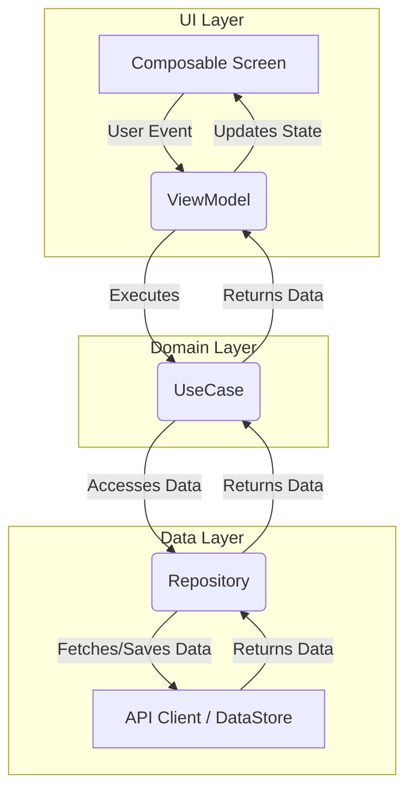

# Aniiiiict: 技術仕様・アーキテクチャガイド

このドキュメントは、Aniiiiictプロジェクトの現在の仕様、アーキテクチャ、および開発ワークフローの全貌を把握するための一元的な資料です。

## 1. 概要 (Overview)

**Aniiiiict**は、アニメの視聴記録・管理サービス [Annict](https://annict.com) のための非公式Androidクライアントアプリケーションです。ユーザーはAnnictアカウントでログインし、視聴中のアニメの管理、エピソードごとの視聴記録、視聴履歴の確認などを行うことができます。

### 主な機能

- AnnictのOAuth 2.0を利用した安全なログイン
- 視聴中、視聴予定などのステータスごとのアニメ一覧表示
- 作品のシーズン、メディア種別、放送チャンネルなどに基づく高度な絞り込み機能
- エピソードを視聴済みとして記録する機能
- 最終話を視聴した際に、作品全体のステータスを「視聴済み」に更新するかの確認機能
- 過去の視聴記録を一覧で確認できる履歴画面
- 記録の削除機能

## 2. 技術スタックと主要ライブラリ (Tech Stack and Key Libraries)

本プロジェクトは、モダンなAndroid開発で推奨される技術スタックで構築されています。

- **言語:** [Kotlin](https://kotlinlang.org/) 2.1.21
- **UI:** [Jetpack Compose](https://developer.android.com/jetpack/compose) 2025.06.00 - UIを宣言的に構築
- **デザイン:** [Material 3](https://m3.material.io/) 1.3.2 - 公式のデザインシステム
- **DI（依存性注入）:** [Hilt](https://dagger.dev/hilt/) 2.57 - DIコンテナ
- **非同期処理:** [Kotlin Coroutines](https://kotlinlang.org/docs/coroutines-overview.html) & [Flow](https://kotlinlang.org/docs/flow.html) 1.9.0
- **ネットワーキング:**
  - [Apollo Kotlin](https://www.apollographql.com/docs/kotlin/) 4.3.2 - Annict/AniList API用のGraphQLクライアント
  - [OkHttp](https://square.github.io/okhttp/) 4.12.0 - HTTPクライアント
- **データ永続化:** [DataStore](https://developer.android.com/topic/libraries/architecture/datastore) 1.1.6 - フィルタ設定などの小規模データ保存
- **画像読み込み:** [Coil](https://coil-kt.github.io/coil/) 2.5.0
- **ナビゲーション:** [Navigation Compose](https://developer.android.com/jetpack/compose/navigation) 2.9.0
- **ロギング:** [Timber](https://github.com/JakeWharton/timber) 5.0.1
- **テスト:**
  - [JUnit4](https://junit.org/junit4/) 4.13.2
  - [Mockito](https://site.mockito.org/) 5.10.0 & [MockK](https://mockk.io/) 1.13.10
  - [Kotest](https://kotest.io/) 5.8.1 - アサーションライブラリ
  - [Robolectric](http://robolectric.org/) 4.10.3
  - [Compose UI Tests](https://developer.android.com/jetpack/compose/testing)

## 3. アーキテクチャ (Architecture)

プロジェクトの基盤として、**Clean Architecture**と**MVVM (Model-View-ViewModel)**を組み合わせたパターンを採用しています。これにより、関心事の分離、テストの容易性、保守性の向上を実現しています。

### レイヤー構造

アーキテクチャは以下の3つの主要なレイヤーで構成されています。

1.  **UI (Presentation) Layer:**
    -   **役割:** 画面表示とユーザーインタラクションの処理。
    -   **構成要素:** `Activity`, `Composable Screen`, `ViewModel`。
    -   **詳細:** Jetpack Composeを用いてUIを宣言的に構築します。`ViewModel`がUIの状態(`StateFlow`)を保持し、ユーザーからのイベントを処理します。UIは`ViewModel`から公開される状態を観測し、画面を更新します。

2.  **Domain Layer:**
    -   **役割:** アプリケーション固有のビジネスロジック（ビジネスルール）のカプセル化。
    -   **構成要素:** `UseCase`。
    -   **詳細:** このレイヤーは、特定のフレームワーク（Android SDKなど）から完全に独立した、Pure Kotlinモジュールです。`UseCase`は、単一の機能（例: 番組一覧の読み込み、エピソードの記録）を担当し、Dataレイヤーの`Repository`を介してデータを操作します。

3.  **Data Layer:**
    -   **役割:** アプリケーションのデータに関するすべての処理。データの取得、保存、管理を担当します。
    -   **構成要素:** `Repository`, `API Client (Apollo)`, `DataStore`。
    -   **詳細:** `Repository`パターンを採用し、`ViewModel`や`UseCase`に対してデータの出所（リモートAPI、ローカルDBなど）を抽象化します。このプロジェクトでは、Annict API (GraphQL) と、データ補完用のAniList API (GraphQL) の2つを主なデータソースとしています。

### データフロー

基本的なデータの流れは一方向であり、以下のようになります。



1.  **UI**がユーザーイベントを`ViewModel`に通知します。
2.  `ViewModel`は対応する`UseCase`を実行します。
3.  `UseCase`はビジネスロジックを実行し、`Repository`に必要なデータを要求します。
4.  `Repository`は、APIや`DataStore`からデータを取得し、`UseCase`に返します。
5.  `UseCase`は取得したデータを加工し、`ViewModel`に返します。
6.  `ViewModel`は受け取ったデータでUIの状態(`StateFlow`)を更新し、UIがリアクティブに再描画されます。

## 4. 主要機能の実装詳細 (Implementation Details of Key Features)

### 認証 (Authentication)

-   **フロー:** AnnictのOAuth 2.0認証フローに基づいています。
-   **実装:**
    1.  `AuthScreen`でユーザーがログインボタンをクリックすると、`MainViewModel`が`AnnictAuthUseCase`を介して認証URLを取得します。
    2.  `CustomTabsIntent`を使用して、Annictの認証ページをアプリ内で開きます。
    3.  ユーザーが認証を許可すると、`aniiiiict://oauth/callback`のコールバックURLにリダイレクトされ、`MainActivity`の`onNewIntent`が受け取ります。
    4.  `MainActivity`は認証コードを`MainViewModel`に渡し、`ViewModel`は`AnnictRepository`の`handleAuthCallback`を呼び出してアクセストークンを取得・保存します。
    5.  トークンは`TokenManager`によって`DataStore`に安全に永続化されます。

### 番組一覧表示 (Program Tracking)

-   **フロー:** 視聴中のアニメ一覧を`TrackScreen`に表示する機能です。
-   **実装:**
    1.  `TrackScreen`が表示されると、`TrackViewModel`が`loadingPrograms`関数を実行します。
    2.  `loadingPrograms`は`LoadProgramsUseCase`を実行します。
    3.  `LoadProgramsUseCase`は`AnnictRepository`の`getRawProgramsData`を呼び出します。
    4.  `AnnictRepositoryImpl`は、Apolloクライアントを使って`ViewerPrograms.graphql`クエリを実行し、APIからデータを取得します。
    5.  取得した生データは`LoadProgramsUseCase`で加工されます。具体的には、作品ごとにエピソードがグループ化され、放送日時でソートされた`ProgramWithWork`のリストに変換されます。
    6.  このリストが`TrackViewModel`に返され、UI状態が更新されて画面に表示されます。

## 5. データモデル (Data Models)

`data/model`パッケージには、APIレスポンスをアプリケーション内で扱いやすいように変換したカスタムデータクラスが定義されています。

-   **`Work`**: アニメ作品の情報を保持します（タイトル、シーズン、メディア種別など）。
-   **`Program`**: 個々の放送予定（エピソード）の情報を保持します（放送日時、チャンネル、エピソード詳細など）。
-   **`Episode`**: エピソード自体の情報を保持します（ID、話数、タイトルなど）。
-   **`ProgramWithWork`**: `Work`と、それに関連する`Program`のリストを組み合わせたモデル。UIレイヤーで扱いやすいように設計されています。
-   **`Record`**: 視聴記録の情報を保持します。

## 6. テスト戦略 (Testing Strategy)

本プロジェクトは、**プロダクションコードを汚染しない拡張ベースのテストアプローチ**というユニークなテスト戦略を採用しています。

### 基本原則

-   **プロダクションコードの純粋性:** `ViewModel`などのプロダクションコードには、テスト専用のコード（状態を強制的に変更するセッターなど）を一切含めません。
-   **テストコードの分離:** テスト用のユーティリティはすべて`app/src/test`ソースセット内に実装します。
-   **安全性:** テスト専用のメソッドがプロダクションビルドに含まれたり、誤って呼び出されたりするリスクを完全に排除します。

### 実装例

**プロダクションViewModel (純粋):**
```kotlin
// in app/src/main
@HiltViewModel
class TrackViewModel @Inject constructor(...) : BaseViewModel(), TrackViewModelContract {
    private val _uiState = MutableStateFlow(TrackUiState())
    override val uiState: StateFlow<TrackUiState> = _uiState.asStateFlow()
    // ビジネスロジックのみ
}
```

**テスト専用拡張 (テストコード内):**
```kotlin
// in app/src/test
interface TestableTrackViewModel {
    fun setUiStateForTest(state: TrackUiState)
}

// 拡張関数でViewModelをテスト可能に
fun TrackViewModel.asTestable(): TestableTrackViewModel {
    // リフレクション等を使い、テストからのみ状態を操作するラッパーを返す
    ...
}
```

**テストコードでの使用:**
```kotlin
@Test
fun `some test case`() {
    val viewModel = TrackViewModel(...)
    val testable = viewModel.asTestable() // テスト専用インターフェースを取得

    // テストのために特定の状態を強制的に設定
    testable.setUiStateForTest(TrackUiState(isLoading = true))

    // 状態が正しく設定されたかを検証
    assertEquals(true, viewModel.uiState.value.isLoading)
}
```

このアプローチにより、プロダクションコードの品質と安全性を維持しつつ、高いテスト容易性を両立しています。

### 詳細ガイド (Detailed Guides)

より詳細なテスト戦略や具体的なテストの実行方法については、以下のドキュメントを参照してください。

-   [**ViewModelのテストアプローチ**](./docs/CLEAN_TESTING_APPROACH.md): プロダクションコードを汚染しない、本プロジェクト独自のViewModelテストアーキテクチャに関する詳細な解説です。
-   [**Compose UIテストガイド**](./docs/COMPOSE_UI_TESTS.md): Jetpack Composeで作成されたUIのテストケース一覧と、その実行方法に関する実践的なガイドです。

## 7. 開発ワークフロー (Development Workflow)

-   **Issue駆動開発:** すべてのタスクはGitHubのIssueとして管理されます。
-   **ブランチ戦略:**
    -   `master`がメインブランチです。
    -   機能追加やバグ修正は、`feat/issue-xx`や`fix/issue-xx`のようなプレフィックスを持つフィーチャーブランチを作成して行います。
    -   変更はすべてプルリクエストを通じてレビューされ、承認後に`master`にマージされます。
-   **静的解析:** Detektを利用してコード品質を維持しています。

---
*このドキュメントは、現在のコードベースを基に自動生成されました。*
